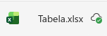
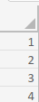
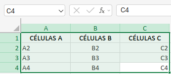
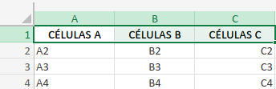
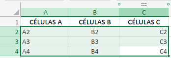
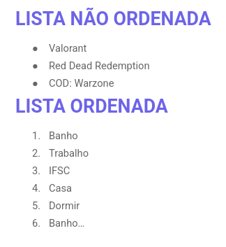

# 📊 Analogia: HTML vs. Excel

* **`<table>` (O Arquivo/Planilha):** É o arquivo `.xlsx` inteiro. Sem ele, você não tem onde colocar os dados. Ele avisa ao navegador: "Tudo o que estiver aqui dentro faz parte de uma tabela".



* **`<tr>` (A Linha Numerada):** No Excel, são as linhas 1, 2, 3... Você não consegue escrever um dado no "vácuo"; você primeiro escolhe em qual **Linha** vai trabalhar.



* **`<td>` ou `<th>` (A Célula):** É o quadradinho individual (ex: A1, B1). É aqui que você digita o valor.



* **`<th>` (Table Header):** É como aquela célula que você coloca em **Negrito e Centralizado** para ser o título da coluna.



* **`<td>` (Table Data):** É a célula de dado comum, onde vai o conteúdo normal.



---

## Exemplo Visual no Código

```html
    <table>
        <tr>
            <th>Dia</th>
            <th>Matéria</th>
        </tr>

        <tr>
            <td>Segunda</td>
            <td>Frontend I</td>
        </tr>

    </table> <br><br>
    <table>
        ...
    </table>

```

### Resumo da Hierarquia

> **Arquivo** (`table`) > **Linha** (`tr`) > **Célula** (`td`/`th`)

**Um erro comum que você cometeu antes:** Tentar colocar uma linha (`tr`) dentro de uma célula (`td`). No Excel, você nunca conseguiria colocar a "Linha 5" inteira dentro do quadradinho "A1", certo? No HTML é a mesma coisa!

## 📊 Listas

### 1. Lista Não-Ordenada (`<ul>`)

O `ul` vem de *Unordered List*. É aquela lista com "bolinhas" (bullets), onde a ordem dos itens não altera o sentido.

* **Tag Mãe:** `<ul>`
* **Tag do Item:** `<li>` (de *List Item*)

### 2. Lista Ordenada (`<ol>`)

O `ol` vem de *Ordered List*. É a lista numerada (1, 2, 3...), usada para passos de um processo ou rankings, onde a ordem importa.

* **Tag Mãe:** `<ol>`
* **Tag do Item:** `<li>`



#### **Dica**

* `<ul>`, `<ol>` e `<li>` são elementos de **bloco**. Isso significa que cada item da lista automaticamente começa numa linha nova, ocupando a largura toda.
